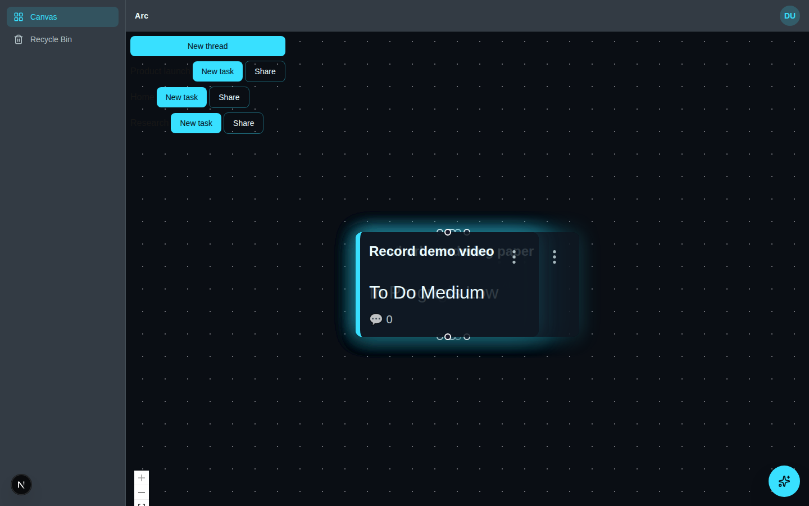
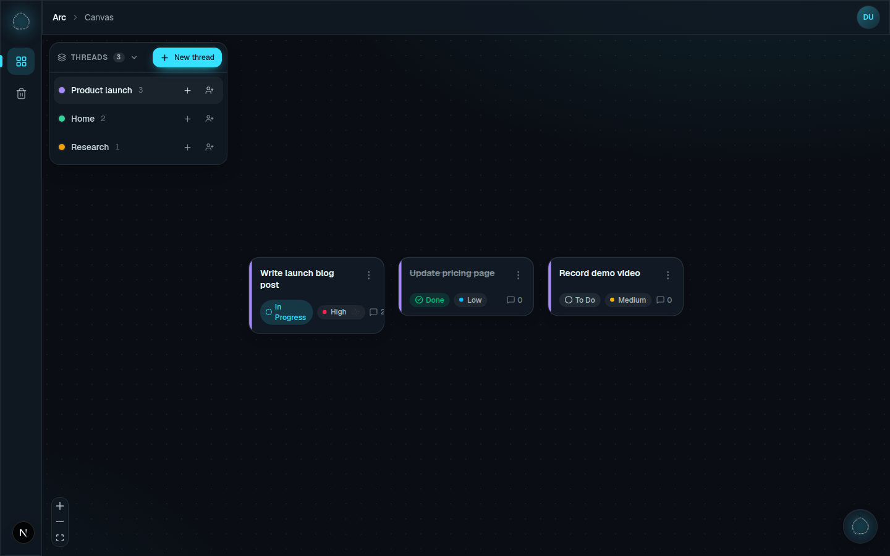
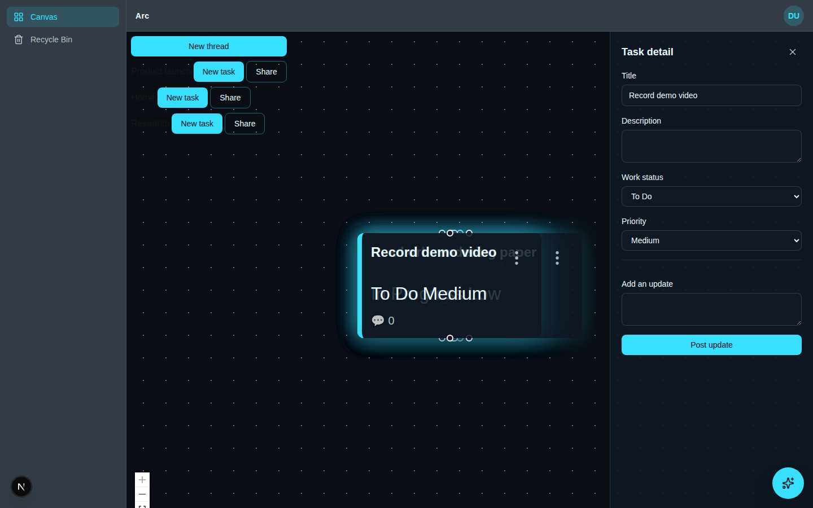
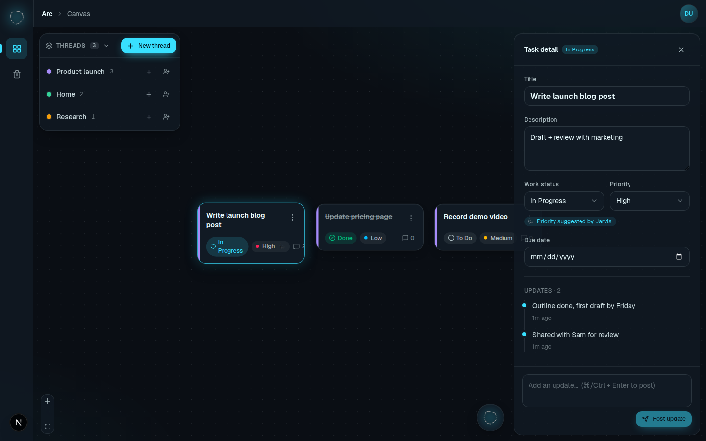
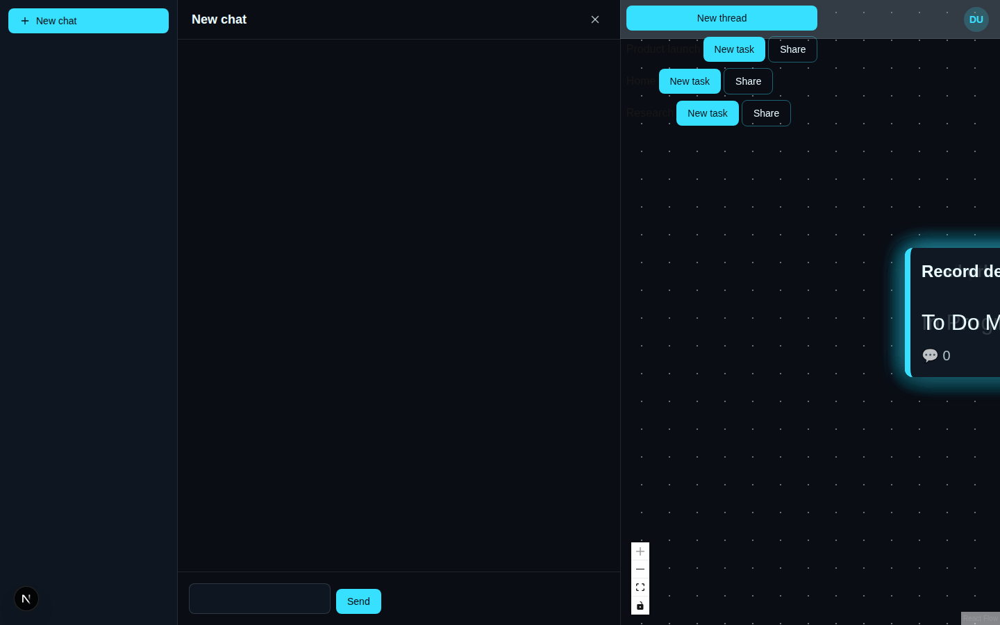
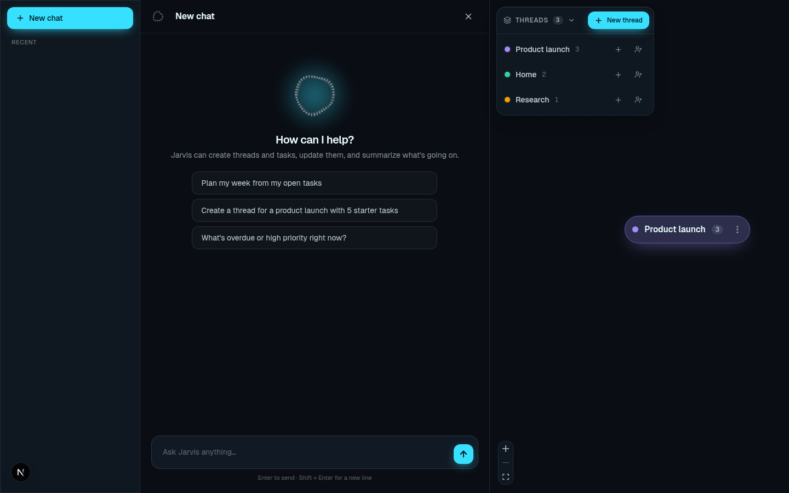
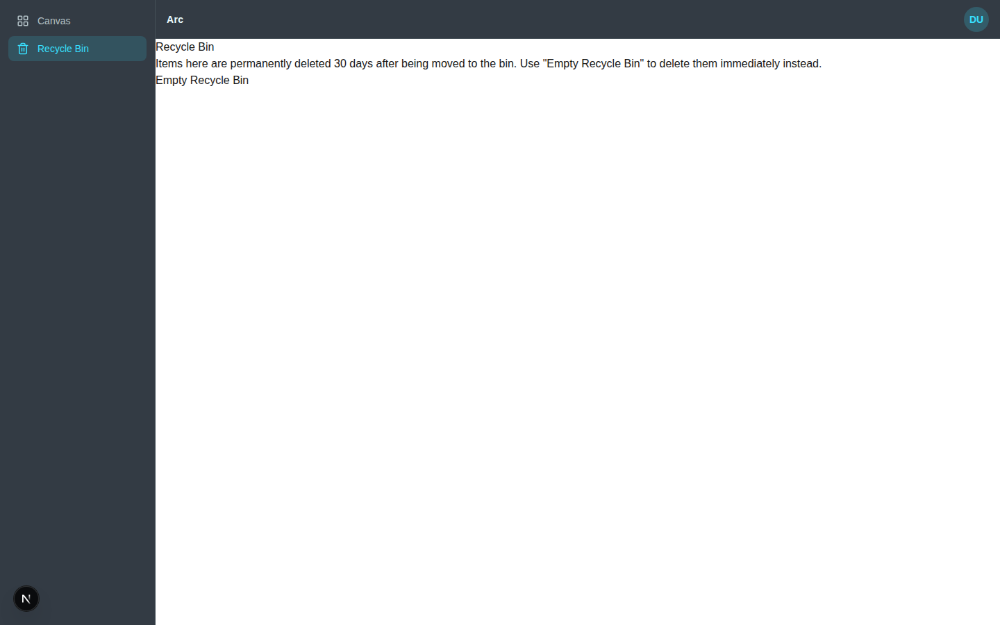
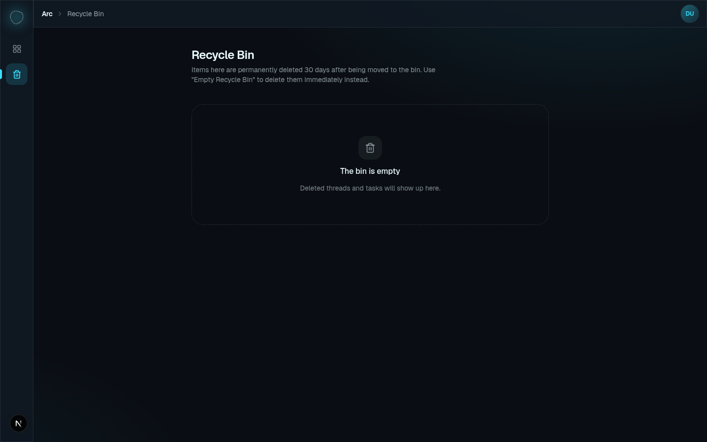

# Design & UX audit — Arc

This document records a design and UX audit of the app (run locally against Postgres 16 with seeded demo data), what each finding was, and what changed. The screenshots are in [`docs/audit/`](./audit).

## Before → after

| Before | After |
| --- | --- |
|  |  |
|  |  |
|  |  |
|  |  |

More screens: [login](./audit/after-login.png) · [zoomed-out thread bubbles](./audit/after-bubbles.png) · [new-thread dialog](./audit/after-modal.png) · [light mode + user menu](./audit/after-usermenu.png) · [390px phone](./audit/after-mobile.png)

## Findings

Severity: **High** means it breaks or blocks a task, **Med** means it causes confusion or friction, and **Low** means polish.

### Visual design

| # | Sev | Finding | Fix |
| --- | --- | --- | --- |
| V1 | High | The Recycle Bin page had no styling: black-on-white default HTML inside a dark app. | Rebuilt it with themed rows, badges, an empty state, and a destructive-styled "Empty Recycle Bin" button. |
| V2 | High | Thread names in the canvas toolbar were unstyled ``s with no text color, which made them invisible in dark mode. | Replaced the toolbar with the new **Threads panel** (see U3). |
| V3 | Med | `globals.css` forced `font-family: Arial` over the loaded Geist font, and a leftover `prefers-color-scheme` block used a white background that fought the app's own theme. | Removed both. Body now uses Geist on the theme background with a faint accent aurora. |
| V4 | Med | Task cards used inline styles, emoji (🤖 💬), 12px/8px text, and plain-text status/priority with no color meaning. The cards were also translucent, so overlapping cards bled through each other. | Rebuilt cards on an opaque surface. They have a thread-color stripe, a color-coded status pill (To Do / In Progress / Done with icons), a priority dot, a comment icon, and an animated orb for "AI suggested". Done tasks are struck through. |
| V5 | Med | The accent glow was always on, so every card had a large cyan halo. | The glow now appears only on hover or selection, together with a small lift. |
| V6 | Med | React Flow's zoom controls were unthemed: white buttons in dark mode. | Themed the controls, background dots and handles. The controls are now a glass pill. |
| V7 | Med | Thread bubbles were drawn at canvas scale in the zoomed-out tier (zoom < 0.6), which made them tiny and unreadable. They also forced dark text onto whatever category color was chosen. | Bubbles now compensate for zoom and use a tint of the category color with a pulsing color dot and a task count. |
| V8 | Low | The `<title>` was "Create Next App" while the app calls itself "Arc". | Real metadata ("Arc", with a per-page template), plus `viewport.themeColor`. |
| V9 | Low | There were no design tokens beyond five CSS variables, and every component repeated `[var(--text,#eafcff)]/10`. | Added semantic Tailwind colors (`fg`, `accent`, `surface`, `canvas`, `on-accent`), shared field styles, and `.glass`/`.elevated` surfaces. |
| V10 | Low | Theme variables were applied only after hydration, so the first paint flashed the defaults. | The root layout now renders the variables and `data-theme` on the server. |
| V11 | Low | Text on accent-colored buttons was hard-coded, so light accent colors left it unreadable. | `--on-accent` is now computed from the accent color's luminance and is unit-tested. |

### UX and interaction

| # | Sev | Finding | Fix |
| --- | --- | --- | --- |
| U1 | High | Tasks without a saved position (a thread shared with you, or tasks Jarvis created) all rendered at `{0,0}`, stacked into one pile. | When a task has no saved position, the client places it on the same per-thread grid `createTask` uses (`computeInitialTaskOffset`/`computeInitialThreadOffset`). |
| U2 | High | The canvas was sized `100vh` inside `<main>`, below a 56px navbar. It overflowed, and the zoom controls ended up off screen. | The canvas now fills `<main>`. |
| U3 | Med | The toolbar added a row of full-size "New task" and "Share" buttons for every thread, which covered the canvas. | Replaced with a collapsible floating **Threads panel**. Each thread gets a compact row with a color legend, a task count, a role badge and icon actions. Clicking a thread pans and zooms to its cards. "New task" is hidden for viewers, who can't create tasks on the server anyway. |
| U4 | Med | Nothing animated: dialogs, menus, the task rail and Jarvis appeared and vanished abruptly. | Added enter motion: fade and pop for dialogs and menus, a slide-in for the task rail, a slide-up for messages, list rows and panels, and hover lift or press scale on interactive elements. All of it respects `prefers-reduced-motion`. |
| U5 | Med | The Jarvis launcher sat on top of the task rail's "Post update" button. | The launcher moves left of the rail while the rail is open. |
| U6 | Med | The Jarvis composer rendered as a narrow box (its wrapper didn't grow). There was no Enter-to-send, no empty state, and "You:"/"Jarvis:" prefixes duplicated what bubble alignment already shows. | Full-width composer that grows with its content. Enter sends and Shift+Enter adds a newline. The empty state has three suggested prompts. Tool results show as ✓/✗ chips. The speaker prefixes are now screen-reader-only. |
| U7 | Med | On phones, the Jarvis workspace was squeezed into about 30px beside a 360px canvas strip. | Below `md`, the workspace goes full-width, the preview strip is hidden, and a header button starts a new chat. |
| U8 | Med | Create dialogs had no autofocus: the Modal stole focus from `autoFocus` fields. They could also be submitted empty, and Enter didn't submit. | The Modal keeps focus that's already inside it (with a regression test). Title fields autofocus, submit is disabled until the form is valid, and Enter submits. |
| U9 | Med | Recycle Bin: after Restore or Empty, items stayed in the list until a manual reload. Restoring a task whose thread was also deleted failed silently. | The form actions now call `refresh()` from `next/cache`. Tasks blocked by a deleted thread say "Restore its thread first" instead of offering a button that can't work. |
| U10 | Low | Task detail had no way to set a due date, no timestamps on updates, and "Post update" was enabled with an empty draft. | Added a due-date field, an update timeline with relative times, ⌘/Ctrl+Enter to post, and the button is disabled when the draft is empty. |
| U11 | Low | The 224px sidebar held only two links. | Replaced it with a 68px icon rail with tooltips and an active indicator. The navbar shows a breadcrumb, and on phones the nav links move into the header. |
| U12 | Low | There were no keyboard shortcuts. | Pressing `J` opens Jarvis. It's ignored while you're typing, while a dialog is open, or when a modifier key is held. |

## Animation: thinking-orbs

The animated dotted orbs come from [`thinking-orbs`](https://github.com/Jakubantalik/thinking-orbs) (MIT, on npm). They draw on a 2D canvas, pause when offscreen or when the tab is hidden, and show a static frame when reduced motion is on. They're wrapped by `components/ui/Orb.tsx`, which adds an accent-tinted halo and scales the library's two tuned sizes (20 and 64px) to any size.

Orbs are used **only for AI and Jarvis states**, so the motion always means "Jarvis":

| Where | Orb state |
| --- | --- |
| Jarvis launcher, sidebar brand, auth screens, empty chat | `breathing` (idle) |
| Jarvis is replying, AI-suggested priority badge | `working` |
| Catch-up modal while loading | `weaving` |
| Empty canvas | `shaping` |

## Left as-is (follow-ups)

- **"Move to thread" and "Link secondary thread" still use `window.prompt`.** Replacing them with a thread picker dialog is the next biggest UX improvement.
- **Two lint errors (`react-hooks/set-state-in-effect`) predate this work.** They're in `Canvas.tsx` and `JarvisWorkspace.tsx`.
- **The Jarvis session list is hidden below `md`.** Phones can start a new chat but can't switch between past chats yet.
